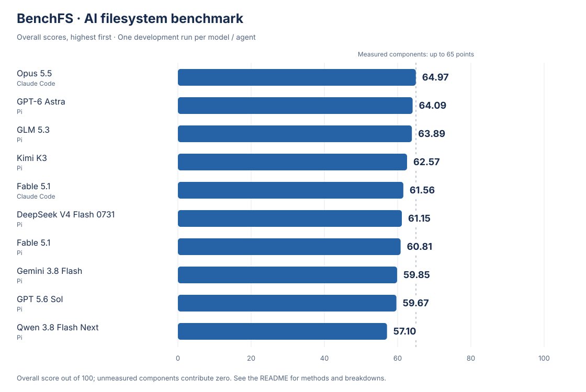

# BenchFS: Can AI build a reliable filesystem on its own?

[中文](README.zh-CN.md) · [Results](#results) · [Methods](#methods) · [Experimental setup](#setup)

Saving a file looks simple. Behind that operation, a filesystem must find free space, write the data, update its metadata, and make sure the file is still intact the next time it is opened. Concurrent access, a nearly full disk, and an unexpected interruption make the job harder.

**BenchFS gives that job to AI.** Each coding agent receives the same task specification, Rust SDK, FUSE interface, and starter code. It implements, tests, and debugs the filesystem autonomously. The submitted source is then rebuilt in a fresh virtual machine and put through independent tests.

A filesystem's components have to work together. A local change can affect another operation, and a write that appears successful can reveal a problem only after a restart. BenchFS asks what AI can deliver when a project requires sustained development and many details must be correct at once.

<a id="results"></a>

## Results

These results cover the Core filesystem task: file operations, on-disk format, robustness, crash recovery, and real applications. Entries are ordered by overall score, highest first.

<!-- core-results:begin -->


Dimension scores are out of 100. Under the existing weights, the measured dimensions account for **75 points** of the overall score; unmeasured components contribute zero. Click a model for its report.

| Model | Coding agent | Total / 100 | Correctness | Robustness | Applications | Performance | Active time | Output tokens | Est. cost (USD) |
|---|---|---:|---:|---:|---:|---:|---:|---:|---:|
| [Opus 5.5](results/core/opus-5.5-high-cc.md) | Claude Code | **72.28** | 99.73 | 100.00 | 100.00 | 46.81 | 3:07:09 | 472,273 | $39.28 |
| [GPT 6.1 Sol](results/core/gpt-6.1-sol-high.md) | Pi | **71.24** | 97.45 | 100.00 | 83.33 | 44.52 | 7:14:12 | 184,515 | $12.87 |
| [GPT-6 Astra](results/core/gpt-6-astra-high.md) | Pi | **71.20** | 97.33 | 100.00 | 83.33 | 44.09 | 3:52:51 | 199,142 | $77.86 |
| [GLM 5.3](results/core/glm-5.3-high.md) | Pi | **70.48** | 95.81 | 99.77 | 83.33 | 38.23 | 7:32:19 | 541,837 | $62.99 |
| [Fable 5.1](results/core/fable-5.1-high-cc.md) | Claude Code | **69.10** | 97.45 | 68.52 | 83.33 | 49.90 | 2:59:12 | 340,562 | $40.69 |
| [Fable 5.1](results/core/fable-5.1-high.md) | Pi | **68.20** | 95.52 | 63.43 | 83.33 | 47.82 | 5:16:10 | 298,429 | $72.41 |
| [DeepSeek V4 Flash 0731](results/core/deepseek-v4-flash-0731-high.md) | Pi | **67.93** | 89.72 | 82.48 | 66.67 | 39.87 | ≥12:19:49 | 518,078 | $3.26 |
| [Gemini 3.8 Flash](results/core/gemini-3.8-flash-high.md) | Pi | **66.60** | 90.57 | 78.59 | 50.00 | 39.52 | 3:05:17 | 267,908 | $31.62 |
| [GPT 5.6 Sol](results/core/gpt-5.6-sol-high.md) | Pi | **64.32** | 95.44 | 88.45 | 33.33 | 21.36 | 2:42:57 | 87,220 | $7.81 |
| [Qwen 3.8 Flash Next](results/core/qwen-3.8-flash-next-high.md) | Pi | **64.03** | 89.21 | 67.85 | 33.33 | 41.81 | ≥12:00:54 | 734,568 | $3.29 |
| [Kimi K3](results/core/kimi-k3-high.md) | Pi | **62.57** | 93.48 | 96.20 | 66.67 | 0.00 | 6:52:08 | 478,897 | $90.50 |

Each row represents one development run. Agent configurations are described below, with separate entries for different agents. See [scoring](docs/scoring.md) for the formula.

Time is the agent-recorded active duration (h:mm:ss); ≥ marks the last record when no final completion time was recorded. Output tokens cover the main model and include reasoning. Costs use the API prices and cache usage documented in each report, including task-completion checks for Claude Code. Subscription runs are also estimated at API prices. Time, tokens, and cost do not affect scores; full usage and calculations are in the reports.

<details>
<summary>Reference implementation</summary>

Reference is a calibration implementation. Its scores and report are listed below.

| Implementation | Total / 100 | Correctness | Robustness | Applications | Performance |
|---|---:|---:|---:|---:|---:|
| [Reference](results/eval-only/reference-calibration.md) | 61.50 | 74.87 | 97.82 | 100.00 | — |

</details>
<!-- core-results:end -->

<a id="methods"></a>

## How we test

```text
Shared specification, SDK, and starter code
                    ↓
Autonomous implementation, testing, and debugging
                    ↓
Source submission and rebuild in a fresh VM
                    ↓
Independent tests and aggregate scores
```

The agent implements the filesystem's storage and operation logic. A fixed FUSE adapter connects Linux file operations to that implementation. Development feedback tests are available to the agent; the full evaluation runs after submission, without sending results back into development.

The tables below follow the overall score order. “Passed / applicable” counts tests that met their expectations, including expected failures. N/A tests are excluded and timeouts count as failures. Except for the format score, scores weight test categories equally, so they can differ from the overall case pass rate. The format profile uses its own conformance score. See [scoring](docs/scoring.md) for details.

### File operations

A filesystem must first handle everyday operations correctly: reading and writing files, managing directories and links, and checking permissions. BenchFS-specific checks and two upstream suites test individual operations and their interactions.

**BenchFS semantic tests.** These check behavior required by the task specification, including basic operations and boundary conditions.

<!-- profile-spec-tests:begin -->
| Model / Agent | Passed / applicable | Pass rate | Score / 100 |
|---|---:|---:|---:|
| [Opus 5.5](results/core/opus-5.5-high-cc.md) · Claude Code | 44 / 44 | 100.00% | 100.00 |
| [GPT 6.1 Sol](results/core/gpt-6.1-sol-high.md) · Pi | 44 / 44 | 100.00% | 100.00 |
| [GPT-6 Astra](results/core/gpt-6-astra-high.md) · Pi | 44 / 44 | 100.00% | 100.00 |
| [GLM 5.3](results/core/glm-5.3-high.md) · Pi | 44 / 44 | 100.00% | 100.00 |
| [Fable 5.1](results/core/fable-5.1-high-cc.md) · Claude Code | 44 / 44 | 100.00% | 100.00 |
| [Fable 5.1](results/core/fable-5.1-high.md) · Pi | 44 / 44 | 100.00% | 100.00 |
| [DeepSeek V4 Flash 0731](results/core/deepseek-v4-flash-0731-high.md) · Pi | 44 / 44 | 100.00% | 100.00 |
| [Gemini 3.8 Flash](results/core/gemini-3.8-flash-high.md) · Pi | 44 / 44 | 100.00% | 100.00 |
| [GPT 5.6 Sol](results/core/gpt-5.6-sol-high.md) · Pi | 44 / 44 | 100.00% | 100.00 |
| [Qwen 3.8 Flash Next](results/core/qwen-3.8-flash-next-high.md) · Pi | 44 / 44 | 100.00% | 100.00 |
| [Kimi K3](results/core/kimi-k3-high.md) · Pi | 44 / 44 | 100.00% | 100.00 |
<!-- profile-spec-tests:end -->

**pjdfstest.** System-call tests check POSIX file semantics, including permissions, metadata, and error handling.

<!-- profile-pjdfstest-core:begin -->
| Model / Agent | Passed / applicable | Pass rate | Score / 100 |
|---|---:|---:|---:|
| [Opus 5.5](results/core/opus-5.5-high-cc.md) · Claude Code | 169 / 169 | 100.00% | 100.00 |
| [GPT 6.1 Sol](results/core/gpt-6.1-sol-high.md) · Pi | 169 / 169 | 100.00% | 100.00 |
| [GPT-6 Astra](results/core/gpt-6-astra-high.md) · Pi | 169 / 169 | 100.00% | 100.00 |
| [GLM 5.3](results/core/glm-5.3-high.md) · Pi | 169 / 169 | 100.00% | 100.00 |
| [Fable 5.1](results/core/fable-5.1-high-cc.md) · Claude Code | 169 / 169 | 100.00% | 100.00 |
| [Fable 5.1](results/core/fable-5.1-high.md) · Pi | 168 / 169 | 99.41% | 99.26 |
| [DeepSeek V4 Flash 0731](results/core/deepseek-v4-flash-0731-high.md) · Pi | 169 / 169 | 100.00% | 100.00 |
| [Gemini 3.8 Flash](results/core/gemini-3.8-flash-high.md) · Pi | 169 / 169 | 100.00% | 100.00 |
| [GPT 5.6 Sol](results/core/gpt-5.6-sol-high.md) · Pi | 169 / 169 | 100.00% | 100.00 |
| [Qwen 3.8 Flash Next](results/core/qwen-3.8-flash-next-high.md) · Pi | 169 / 169 | 100.00% | 100.00 |
| [Kimi K3](results/core/kimi-k3-high.md) · Pi | 169 / 169 | 100.00% | 100.00 |
<!-- profile-pjdfstest-core:end -->

**xfstests.** Upstream filesystem tests exercise operation sequences, data integrity, and more involved usage scenarios.

<!-- profile-xfstests-core:begin -->
| Model / Agent | Passed / applicable | Pass rate | Score / 100 |
|---|---:|---:|---:|
| [Opus 5.5](results/core/opus-5.5-high-cc.md) · Claude Code | 189 / 194 | 97.42% | 98.90 |
| [GPT 6.1 Sol](results/core/gpt-6.1-sol-high.md) · Pi | 187 / 194 | 96.39% | 89.81 |
| [GPT-6 Astra](results/core/gpt-6-astra-high.md) · Pi | 179 / 194 | 92.27% | 89.31 |
| [GLM 5.3](results/core/glm-5.3-high.md) · Pi | 183 / 194 | 94.33% | 89.17 |
| [Fable 5.1](results/core/fable-5.1-high-cc.md) · Claude Code | 188 / 194 | 96.91% | 94.36 |
| [Fable 5.1](results/core/fable-5.1-high.md) · Pi | 183 / 194 | 94.33% | 87.35 |
| [DeepSeek V4 Flash 0731](results/core/deepseek-v4-flash-0731-high.md) · Pi | 167 / 194 | 86.08% | 84.02 |
| [Gemini 3.8 Flash](results/core/gemini-3.8-flash-high.md) · Pi | 175 / 194 | 90.21% | 84.61 |
| [GPT 5.6 Sol](results/core/gpt-5.6-sol-high.md) · Pi | 184 / 194 | 94.85% | 89.62 |
| [Qwen 3.8 Flash Next](results/core/qwen-3.8-flash-next-high.md) · Pi | 168 / 194 | 86.60% | 81.52 |
| [Kimi K3](results/core/kimi-k3-high.md) · Pi | 186 / 194 | 95.88% | 89.75 |
<!-- profile-xfstests-core:end -->

### On-disk format

Being able to read a file does not guarantee that the data on disk is organized correctly. These tests inspect the contents written by the filesystem and check them against the required storage format. Both the check pass rate and the native conformance score are shown.

<!-- profile-canonical-format:begin -->
| Model / Agent | Passed / applicable | Pass rate | Score / 100 |
|---|---:|---:|---:|
| [Opus 5.5](results/core/opus-5.5-high-cc.md) · Claude Code | 479 / 479 | 100.00% | 100.00 |
| [GPT 6.1 Sol](results/core/gpt-6.1-sol-high.md) · Pi | 479 / 479 | 100.00% | 100.00 |
| [GPT-6 Astra](results/core/gpt-6-astra-high.md) · Pi | 479 / 479 | 100.00% | 100.00 |
| [GLM 5.3](results/core/glm-5.3-high.md) · Pi | 417 / 479 | 87.06% | 94.05 |
| [Fable 5.1](results/core/fable-5.1-high-cc.md) · Claude Code | 431 / 479 | 89.98% | 95.45 |
| [Fable 5.1](results/core/fable-5.1-high.md) · Pi | 431 / 479 | 89.98% | 95.45 |
| [DeepSeek V4 Flash 0731](results/core/deepseek-v4-flash-0731-high.md) · Pi | 388 / 479 | 81.00% | 74.86 |
| [Gemini 3.8 Flash](results/core/gemini-3.8-flash-high.md) · Pi | 419 / 479 | 87.47% | 77.66 |
| [GPT 5.6 Sol](results/core/gpt-5.6-sol-high.md) · Pi | 442 / 479 | 92.28% | 92.15 |
| [Qwen 3.8 Flash Next](results/core/qwen-3.8-flash-next-high.md) · Pi | 368 / 479 | 76.83% | 75.33 |
| [Kimi K3](results/core/kimi-k3-high.md) · Pi | 410 / 479 | 85.59% | 84.17 |
<!-- profile-canonical-format:end -->

### Robustness

A filesystem also has to handle resource pressure and failed operations. These tests examine behavior under stress and abnormal conditions, checking their effects on existing data and subsequent operations.

<!-- profile-robustness:begin -->
| Model / Agent | Passed / applicable | Pass rate | Score / 100 |
|---|---:|---:|---:|
| [Opus 5.5](results/core/opus-5.5-high-cc.md) · Claude Code | 47 / 47 | 100.00% | 100.00 |
| [GPT 6.1 Sol](results/core/gpt-6.1-sol-high.md) · Pi | 47 / 47 | 100.00% | 100.00 |
| [GPT-6 Astra](results/core/gpt-6-astra-high.md) · Pi | 47 / 47 | 100.00% | 100.00 |
| [GLM 5.3](results/core/glm-5.3-high.md) · Pi | 47 / 47 | 100.00% | 100.00 |
| [Fable 5.1](results/core/fable-5.1-high-cc.md) · Claude Code | 47 / 47 | 100.00% | 100.00 |
| [Fable 5.1](results/core/fable-5.1-high.md) · Pi | 44 / 47 | 93.62% | 90.28 |
| [DeepSeek V4 Flash 0731](results/core/deepseek-v4-flash-0731-high.md) · Pi | 35 / 47 | 74.47% | 69.58 |
| [Gemini 3.8 Flash](results/core/gemini-3.8-flash-high.md) · Pi | 43 / 47 | 91.49% | 89.58 |
| [GPT 5.6 Sol](results/core/gpt-5.6-sol-high.md) · Pi | 40 / 47 | 85.11% | 78.75 |
| [Qwen 3.8 Flash Next](results/core/qwen-3.8-flash-next-high.md) · Pi | 32 / 47 | 68.09% | 66.25 |
| [Kimi K3](results/core/kimi-k3-high.md) · Pi | 46 / 47 | 97.87% | 97.50 |
<!-- profile-robustness:end -->

### Crash recovery

After an unexpected interruption, the filesystem must handle the state left on disk. We interrupt running operations, attempt to restart the filesystem, and check its recovery behavior, required durable data, and structural integrity against the task requirements.

<!-- profile-crash-core:begin -->
| Model / Agent | Passed / applicable | Pass rate | Score / 100 |
|---|---:|---:|---:|
| [Opus 5.5](results/core/opus-5.5-high-cc.md) · Claude Code | 216 / 216 | 100.00% | 100.00 |
| [GPT 6.1 Sol](results/core/gpt-6.1-sol-high.md) · Pi | 216 / 216 | 100.00% | 100.00 |
| [GPT-6 Astra](results/core/gpt-6-astra-high.md) · Pi | 216 / 216 | 100.00% | 100.00 |
| [GLM 5.3](results/core/glm-5.3-high.md) · Pi | 215 / 216 | 99.54% | 99.54 |
| [Fable 5.1](results/core/fable-5.1-high-cc.md) · Claude Code | 80 / 216 | 37.04% | 37.04 |
| [Fable 5.1](results/core/fable-5.1-high.md) · Pi | 79 / 216 | 36.57% | 36.57 |
| [DeepSeek V4 Flash 0731](results/core/deepseek-v4-flash-0731-high.md) · Pi | 206 / 216 | 95.37% | 95.37 |
| [Gemini 3.8 Flash](results/core/gemini-3.8-flash-high.md) · Pi | 146 / 216 | 67.59% | 67.59 |
| [GPT 5.6 Sol](results/core/gpt-5.6-sol-high.md) · Pi | 212 / 216 | 98.15% | 98.15 |
| [Qwen 3.8 Flash Next](results/core/qwen-3.8-flash-next-high.md) · Pi | 150 / 216 | 69.44% | 69.44 |
| [Kimi K3](results/core/kimi-k3-high.md) · Pi | 205 / 216 | 94.91% | 94.91 |
<!-- profile-crash-core:end -->

### Real applications

Finally, real applications use the filesystem. These tests check whether applications can complete their tasks, produce correct data, and work correctly when that data is reopened.

<!-- profile-real-world:begin -->
| Model / Agent | Passed / applicable | Pass rate | Score / 100 |
|---|---:|---:|---:|
| [Opus 5.5](results/core/opus-5.5-high-cc.md) · Claude Code | 4 / 4 | 100.00% | 100.00 |
| [GPT 6.1 Sol](results/core/gpt-6.1-sol-high.md) · Pi | 3 / 4 | 75.00% | 83.33 |
| [GPT-6 Astra](results/core/gpt-6-astra-high.md) · Pi | 3 / 4 | 75.00% | 83.33 |
| [GLM 5.3](results/core/glm-5.3-high.md) · Pi | 3 / 4 | 75.00% | 83.33 |
| [Fable 5.1](results/core/fable-5.1-high-cc.md) · Claude Code | 3 / 4 | 75.00% | 83.33 |
| [Fable 5.1](results/core/fable-5.1-high.md) · Pi | 3 / 4 | 75.00% | 83.33 |
| [DeepSeek V4 Flash 0731](results/core/deepseek-v4-flash-0731-high.md) · Pi | 2 / 4 | 50.00% | 66.67 |
| [Gemini 3.8 Flash](results/core/gemini-3.8-flash-high.md) · Pi | 2 / 4 | 50.00% | 50.00 |
| [GPT 5.6 Sol](results/core/gpt-5.6-sol-high.md) · Pi | 2 / 4 | 50.00% | 33.33 |
| [Qwen 3.8 Flash Next](results/core/qwen-3.8-flash-next-high.md) · Pi | 2 / 4 | 50.00% | 33.33 |
| [Kimi K3](results/core/kimi-k3-high.md) · Pi | 3 / 4 | 75.00% | 66.67 |
<!-- profile-real-world:end -->

<a id="setup"></a>

## Experimental setup

Models receive the same Core task materials. Development and evaluation take place in separate Linux virtual machines.

| Setting | Configuration |
|---|---|
| Development OS | Ubuntu Server 24.04.4 LTS, x86-64; Linux 6.8 |
| Development VM | 8 vCPU, 16 GiB RAM; swap and memory ballooning disabled |
| Development data devices | Separate 64 GiB test and scratch devices |
| Toolchain | Rust 1.97.1, libfuse 3.18.2 |
| Coding agent | Pi 0.84.3; entries labeled Claude Code use 2.1.283 |
| Reasoning setting | High effort; one development run per model / agent combination |
| Development budget | Up to 12 hours; recorded durations are listed in the results table |
| Tools | File access, shell, and local development tools; no subagents, MCP, or built-in web tools |
| Human involvement | Initial task and environment operation; no code edits or technical guidance |
| Evaluation | Rebuild in a fresh VM; network locked before tests; resources and execution backends are recorded in model reports |

Pi and Claude Code differ in tool configuration and how task completion is determined, and are labeled separately in the results. See the [environment](docs/environment.md) and individual reports for details.

## Reports and resources

Model names in the results link directly to full reports, including test statistics, development usage, and source size. Source size is descriptive and does not score implementation quality.

- [Scoring](docs/scoring.md): how profile and overall scores are calculated.
- [Environment](docs/environment.md): development and evaluation settings.
- [Task overview](docs/benchmark.md): task scope and the materials supplied to agents.
- [Test suites](docs/test-suite.md): test composition and development feedback.
- [SDK, FUSE adapter, and starter code](crates/): the fixed participant interfaces.

To reduce exposure of test material to future model training, this repository publishes aggregate results, methods, and interface code while withholding full task specifications, individual test cases, and candidate implementations.
