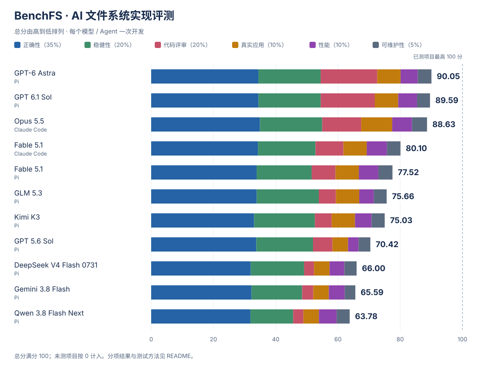

# BenchFS：AI 能独立写出一个可靠的文件系统吗？

[English](README.md) · [评测结果](#results) · [测试方法](#methods) · [实验设置](#setup)

把一个文件存进电脑，看起来只是一次点击。文件系统却要在背后完成一连串工作：找到可用空间，写入数据，更新目录，并确保下一次打开时，文件仍然完好。多个程序同时读写、磁盘接近写满、运行突然中断，都会让这件事变得更复杂。

**BenchFS 把这项任务交给了 AI。** 我们提供统一的任务规格、Rust SDK、FUSE 接口和初始代码框架，由编程 agent 自主完成实现、测试和调试。交付的文件系统随后在全新的虚拟机中重新构建，接受独立测试。

文件系统的难点在于各个部分必须协同工作。一次局部修改可能影响另一个操作，一次看似成功的写入也可能在重新启动后才暴露问题。BenchFS 希望回答：当一项工程需要持续开发、许多细节必须同时正确时，AI 能交付怎样的成果？

<a id="results"></a>

## 评测结果

以下展示 Core 文件系统任务的成绩。测试覆盖文件操作、磁盘格式、稳健性、崩溃恢复和真实应用，按总分从高到低排列。

<!-- core-results:begin -->


分项满分均为 100。总分沿用现有权重，当前已测项目的权重最高覆盖 **100 分**；各实现缺失的分项按 0 暂计。点击模型名称可查看详细报告。

| 模型 | 编程 Agent | 总分 / 100 | 正确性 | 稳健性 | 代码评审 | 真实应用 | 性能 | 可维护性 | 开发活跃时长 | 输出 tokens | 估算费用（美元） |
|---|---|---:|---:|---:|---:|---:|---:|---:|---:|---:|---:|
| [GPT-6 Astra](results/core/gpt-6-astra-high.zh-CN.md) | Pi | **90.05** | 98.40 | 100.00 | 90.91 | 75.00 | 55.44 | 87.63 | 3:52:51 | 199,142 | $77.86 |
| [GPT 6.1 Sol](results/core/gpt-6.1-sol-high.zh-CN.md) | Pi | **89.59** | 98.47 | 100.00 | 86.96 | 75.00 | 60.64 | 83.32 | 7:14:12 | 184,515 | $12.87 |
| [Opus 5.5](results/core/opus-5.5-high-cc.zh-CN.md) | Claude Code | **88.63** | 99.84 | 100.00 | 62.50 | 100.00 | 63.78 | 96.17 | 3:07:09 | 472,273 | $39.28 |
| [Fable 5.1](results/core/fable-5.1-high-cc.zh-CN.md) | Claude Code | **80.10** | 98.02 | 92.44 | 44.84 | 75.00 | 64.83 | 87.02 | 2:59:12 | 340,562 | $40.69 |
| [Fable 5.1](results/core/fable-5.1-high.zh-CN.md) | Pi | **77.52** | 96.74 | 88.50 | 38.31 | 75.00 | 62.63 | 90.76 | 5:16:10 | 298,429 | $72.41 |
| [GLM 5.3](results/core/glm-5.3-high.zh-CN.md) | Pi | **75.66** | 96.89 | 99.72* | 27.47 | 75.00 | 46.94 | 82.30 | 7:32:19 | 541,837 | $62.99 |
| [Kimi K3](results/core/kimi-k3-high.zh-CN.md) | Pi | **75.03** | 94.51 | 97.61* | 26.88 | 75.00 | 53.15 | 84.78 | 6:52:08 | 478,897 | $90.50 |
| [GPT 5.6 Sol](results/core/gpt-5.6-sol-high.zh-CN.md) | Pi | **70.42** | 96.48 | 91.17 | 31.15 | 50.00 | 33.99* | 75.69 | 2:42:57 | 87,220 | $7.81 |
| [DeepSeek V4 Flash 0731](results/core/deepseek-v4-flash-0731-high.zh-CN.md) | Pi | **66.00** | 91.32 | 85.83* | 15.95 | 50.00 | 47.59 | 78.42 | ≥12:19:49 | 518,078 | $3.26 |
| [Gemini 3.8 Flash](results/core/gemini-3.8-flash-high.zh-CN.md) | Pi | **65.59** | 92.11 | 81.28* | 17.86 | 50.00 | 51.24 | 68.11 | 3:05:17 | 267,908 | $31.62 |
| [Qwen 3.8 Flash Next](results/core/qwen-3.8-flash-next-high.zh-CN.md) | Pi | **63.78** | 91.06 | 68.72* | 16.39 | 50.00 | 57.02 | 83.67 | ≥12:00:54 | 734,568 | $3.29 |

每行对应一次独立开发。Agent 配置见下文；不同 Agent 的结果分别列出。总分的计算方式见[评分方法](docs/scoring.zh-CN.md)。

开发活跃时长采用 Agent 的累计计时（时:分:秒）；“≥”表示仅有最后一次记录，未记录最终完成时间。输出 tokens 统计主模型用量，包含推理。费用按各报告注明的 API 标价和缓存用量估算，Claude Code 包含任务完成判断所用模型的开销；订阅运行同样按 API 标价折算。耗时、token 用量和费用均不参与评分，完整用量与计算依据见详细报告。

<details>
<summary>参考实现</summary>

Reference 为参考实现，成绩和报告如下。

| 实现 | 总分 / 100 | 正确性 | 稳健性 | 代码评审 | 真实应用 | 性能 | 可维护性 |
|---|---:|---:|---:|---:|---:|---:|---:|
| [Reference](results/eval-only/reference-calibration.zh-CN.md) | 94.31 | 99.91 | 100.00 | 95.24 | 100.00 | 60.62 | 84.63 |

</details>

当前采用 `core-overall-v3-zero-fill`：六轴直接加权，性能相对 ext4/XFS/Btrfs 固定组合的生产目标使用对数尺度。[新旧分数与校准身份](results/overall-score-v3.json)保留 v2 分数。
<!-- core-results:end -->

<a id="methods"></a>

## 如何评测

```text
提供统一规格、SDK 和代码框架
              ↓
Agent 自主开发、测试和调试
              ↓
收取源码，在新的虚拟机中重新构建
              ↓
运行独立测试，汇总各项成绩
```

Agent 负责实现文件系统的存储和操作逻辑；固定的 FUSE adapter 将 Linux 文件操作转交给实现。开发期间，agent 可以使用提供的反馈测试。完整评测在提交之后进行，agent 不会根据评测结果继续修改实现。

下表均沿用总表顺序。“通过 / 适用”表示满足测试要求的项目数与参与统计的项目数，包含符合预期的失败；不适用项不计入分母，超时计失败。文件操作、稳健性和完整崩溃测试分按类别等权，可能与通过率不同。其他得分使用各自规则。[完整评分说明](docs/scoring.zh-CN.md)

### 文件操作

文件系统首先要正确处理日常操作，包括文件读写、目录管理、链接和权限检查。我们结合 BenchFS 专项测试与两套上游测试，检查单项操作及其组合是否符合要求。

**BenchFS 语义测试。** 按任务规格检查文件系统应提供的行为，覆盖基本操作及其边界情况。

**pjdfstest。** 通过系统调用检查文件操作的 POSIX 语义，包括权限、元数据和错误处理。

**xfstests。** 使用上游文件系统测试，进一步检查操作组合、数据完整性和较复杂的使用场景。

<!-- file-operations:begin -->
| 模型 / Agent | BenchFS 通过 / 适用 | BenchFS 分 | pjdfstest 通过 / 适用 | pjdfstest 分 | xfstests 通过 / 适用 | xfstests 分 |
|---|---:|---:|---:|---:|---:|---:|
| [GPT-6 Astra](results/core/gpt-6-astra-high.zh-CN.md) · Pi | 44 / 44 | 100.00 | 169 / 169 | 100.00 | 179 / 194 | 89.31 |
| [GPT 6.1 Sol](results/core/gpt-6.1-sol-high.zh-CN.md) · Pi | 44 / 44 | 100.00 | 169 / 169 | 100.00 | 187 / 194 | 89.81 |
| [Opus 5.5](results/core/opus-5.5-high-cc.zh-CN.md) · Claude Code | 44 / 44 | 100.00 | 169 / 169 | 100.00 | 189 / 194 | 98.90 |
| [Fable 5.1](results/core/fable-5.1-high-cc.zh-CN.md) · Claude Code | 44 / 44 | 100.00 | 169 / 169 | 100.00 | 188 / 194 | 94.36 |
| [Fable 5.1](results/core/fable-5.1-high.zh-CN.md) · Pi | 44 / 44 | 100.00 | 168 / 169 | 99.26 | 183 / 194 | 87.35 |
| [GLM 5.3](results/core/glm-5.3-high.zh-CN.md) · Pi | 44 / 44 | 100.00 | 169 / 169 | 100.00 | 183 / 194 | 89.17 |
| [Kimi K3](results/core/kimi-k3-high.zh-CN.md) · Pi | 44 / 44 | 100.00 | 169 / 169 | 100.00 | 186 / 194 | 89.75 |
| [GPT 5.6 Sol](results/core/gpt-5.6-sol-high.zh-CN.md) · Pi | 44 / 44 | 100.00 | 169 / 169 | 100.00 | 184 / 194 | 89.62 |
| [DeepSeek V4 Flash 0731](results/core/deepseek-v4-flash-0731-high.zh-CN.md) · Pi | 44 / 44 | 100.00 | 169 / 169 | 100.00 | 167 / 194 | 84.02 |
| [Gemini 3.8 Flash](results/core/gemini-3.8-flash-high.zh-CN.md) · Pi | 44 / 44 | 100.00 | 169 / 169 | 100.00 | 175 / 194 | 84.61 |
| [Qwen 3.8 Flash Next](results/core/qwen-3.8-flash-next-high.zh-CN.md) · Pi | 44 / 44 | 100.00 | 169 / 169 | 100.00 | 168 / 194 | 81.52 |
<!-- file-operations:end -->

### 磁盘格式

文件能够正常读取，并不意味着磁盘上的数据组织一定正确。这组测试直接检查文件系统写出的磁盘内容，验证其是否符合规定的存储格式。表中同时列出检查通过率和格式一致性得分。

<!-- profile-canonical-format:begin -->
| 模型 / Agent | 通过 / 适用 | 通过率 | 得分 / 100 |
|---|---:|---:|---:|
| [GPT-6 Astra](results/core/gpt-6-astra-high.zh-CN.md) · Pi | 479 / 479 | 100.00% | 100.00 |
| [GPT 6.1 Sol](results/core/gpt-6.1-sol-high.zh-CN.md) · Pi | 479 / 479 | 100.00% | 100.00 |
| [Opus 5.5](results/core/opus-5.5-high-cc.zh-CN.md) · Claude Code | 479 / 479 | 100.00% | 100.00 |
| [Fable 5.1](results/core/fable-5.1-high-cc.zh-CN.md) · Claude Code | 431 / 479 | 89.98% | 95.45 |
| [Fable 5.1](results/core/fable-5.1-high.zh-CN.md) · Pi | 431 / 479 | 89.98% | 95.45 |
| [GLM 5.3](results/core/glm-5.3-high.zh-CN.md) · Pi | 417 / 479 | 87.06% | 94.05 |
| [Kimi K3](results/core/kimi-k3-high.zh-CN.md) · Pi | 410 / 479 | 85.59% | 84.17 |
| [GPT 5.6 Sol](results/core/gpt-5.6-sol-high.zh-CN.md) · Pi | 442 / 479 | 92.28% | 92.15 |
| [DeepSeek V4 Flash 0731](results/core/deepseek-v4-flash-0731-high.zh-CN.md) · Pi | 388 / 479 | 81.00% | 74.86 |
| [Gemini 3.8 Flash](results/core/gemini-3.8-flash-high.zh-CN.md) · Pi | 419 / 479 | 87.47% | 77.66 |
| [Qwen 3.8 Flash Next](results/core/qwen-3.8-flash-next-high.zh-CN.md) · Pi | 368 / 479 | 76.83% | 75.33 |
<!-- profile-canonical-format:end -->

### 稳健性

文件系统还需要应对资源紧张和操作失败。这组测试考察它在压力与异常条件下的表现，检查这些情况是否影响已有数据和后续操作。

<!-- profile-robustness:begin -->
| 模型 / Agent | 通过 / 适用 | 通过率 | 得分 / 100 |
|---|---:|---:|---:|
| [GPT-6 Astra](results/core/gpt-6-astra-high.zh-CN.md) · Pi | 47 / 47 | 100.00% | 100.00 |
| [GPT 6.1 Sol](results/core/gpt-6.1-sol-high.zh-CN.md) · Pi | 47 / 47 | 100.00% | 100.00 |
| [Opus 5.5](results/core/opus-5.5-high-cc.zh-CN.md) · Claude Code | 47 / 47 | 100.00% | 100.00 |
| [Fable 5.1](results/core/fable-5.1-high-cc.zh-CN.md) · Claude Code | 47 / 47 | 100.00% | 100.00 |
| [Fable 5.1](results/core/fable-5.1-high.zh-CN.md) · Pi | 44 / 47 | 93.62% | 90.28 |
| [GLM 5.3](results/core/glm-5.3-high.zh-CN.md) · Pi | 47 / 47 | 100.00% | 100.00 |
| [Kimi K3](results/core/kimi-k3-high.zh-CN.md) · Pi | 46 / 47 | 97.87% | 97.50 |
| [GPT 5.6 Sol](results/core/gpt-5.6-sol-high.zh-CN.md) · Pi | 40 / 47 | 85.11% | 78.75 |
| [DeepSeek V4 Flash 0731](results/core/deepseek-v4-flash-0731-high.zh-CN.md) · Pi | 35 / 47 | 74.47% | 69.58 |
| [Gemini 3.8 Flash](results/core/gemini-3.8-flash-high.zh-CN.md) · Pi | 43 / 47 | 91.49% | 89.58 |
| [Qwen 3.8 Flash Next](results/core/qwen-3.8-flash-next-high.zh-CN.md) · Pi | 32 / 47 | 68.09% | 66.25 |
<!-- profile-robustness:end -->

### 崩溃恢复

运行意外中断后，文件系统需要处理磁盘上留下的状态。我们中断正在运行的操作，再尝试重新启动文件系统，检查它是否按照任务要求处理恢复、保留应当持久化的数据，并维持结构完整。

<!-- crash-score:begin -->

完整测试分按用例是否满足全部要求计算。崩溃分分别计入已验证的能力，用于稳健性 R。权重：磁盘结构 40%、数据正确性 40%、卸载与重开 20%。

按规则安全拒绝挂载也计满足要求。前一步失败导致未测试的再次打开不计通过。所有分数满分 100。各检查项目的含义见[评分方法](docs/scoring.zh-CN.md)。

| 模型 / Agent | 完整通过 / 适用 | 完整测试分 | 磁盘结构 | 数据正确性 | 卸载与重开 | 崩溃分 | 失败后未再次打开（项） |
|---|---:|---:|---:|---:|---:|---:|---:|
| [GPT-6 Astra](results/core/gpt-6-astra-high.zh-CN.md) · Pi | 216 / 216 | 100.00 | 100.00 | 100.00 | 100.00 | 100.00 | 0 |
| [GPT 6.1 Sol](results/core/gpt-6.1-sol-high.zh-CN.md) · Pi | 216 / 216 | 100.00 | 100.00 | 100.00 | 100.00 | 100.00 | 0 |
| [Opus 5.5](results/core/opus-5.5-high-cc.zh-CN.md) · Claude Code | 216 / 216 | 100.00 | 100.00 | 100.00 | 100.00 | 100.00 | 0 |
| [Fable 5.1](results/core/fable-5.1-high-cc.zh-CN.md) · Claude Code | 80 / 216 | 37.04 | 100.00 | 100.00 | 37.04 | 87.41 | 136 |
| [Fable 5.1](results/core/fable-5.1-high.zh-CN.md) · Pi | 79 / 216 | 36.57 | 100.00 | 100.00 | 36.57 | 87.31 | 137 |
| [GLM 5.3](results/core/glm-5.3-high.zh-CN.md) · Pi | 215 / 216 | 99.54 | 99.54 | 99.54 | 99.54 | 99.54 | 1 |
| [Kimi K3](results/core/kimi-k3-high.zh-CN.md) · Pi | 205 / 216 | 94.91 | 97.22 | 99.54 | 94.91 | 97.69 | 11 |
| [GPT 5.6 Sol](results/core/gpt-5.6-sol-high.zh-CN.md) · Pi | 212 / 216 | 98.15 | 99.54 | 100.00 | 98.15 | 99.44 | 2 |
| [DeepSeek V4 Flash 0731](results/core/deepseek-v4-flash-0731-high.zh-CN.md) · Pi | 206 / 216 | 95.37 | 95.37 | 98.61 | 95.37 | 96.67 | 10 |
| [Gemini 3.8 Flash](results/core/gemini-3.8-flash-high.zh-CN.md) · Pi | 146 / 216 | 67.59 | 67.59 | 87.96 | 67.59 | 75.74 | 70 |
| [Qwen 3.8 Flash Next](results/core/qwen-3.8-flash-next-high.zh-CN.md) · Pi | 150 / 216 | 69.44 | 69.44 | 71.76 | 69.44 | 70.37 | 66 |
<!-- crash-score:end -->

### Agent 代码评审

<!-- agent-review:begin -->
独立审查、根因去重及讨论确认后的诊断结果；只发布汇总计数。S 按 `agent-review-score-v2` 计分，占暂计总分 20%。

| 模型 / Agent | 状态 | Critical | High | Medium | Low | S / 100 |
|---|---|---:|---:|---:|---:|---:|
| [GPT-6 Astra](results/core/gpt-6-astra-high.zh-CN.md) · Pi | `complete` | 0 | 0 | 2 | 0 | 90.91 |
| [GPT 6.1 Sol](results/core/gpt-6.1-sol-high.zh-CN.md) · Pi | `complete` | 0 | 1 | 0 | 0 | 86.96 |
| [Opus 5.5](results/core/opus-5.5-high-cc.zh-CN.md) · Claude Code | `complete` | 0 | 1 | 9 | 0 | 62.50 |
| [Fable 5.1](results/core/fable-5.1-high-cc.zh-CN.md) · Claude Code | `complete` | 1 | 0 | 16 | 3 | 44.84 |
| [Fable 5.1](results/core/fable-5.1-high.zh-CN.md) · Pi | `complete` | 0 | 6 | 13 | 6 | 38.31 |
| [GLM 5.3](results/core/glm-5.3-high.zh-CN.md) · Pi | `complete` | 1 | 6 | 25 | 9 | 27.47 |
| [Kimi K3](results/core/kimi-k3-high.zh-CN.md) · Pi | `complete` | 4 | 3 | 13 | 2 | 26.88 |
| [GPT 5.6 Sol](results/core/gpt-5.6-sol-high.zh-CN.md) · Pi | `complete` | 2 | 5 | 13 | 1 | 31.15 |
| [DeepSeek V4 Flash 0731](results/core/deepseek-v4-flash-0731-high.zh-CN.md) · Pi | `complete` | 5 | 11 | 31 | 7 | 15.95 |
| [Gemini 3.8 Flash](results/core/gemini-3.8-flash-high.zh-CN.md) · Pi | `complete` | 8 | 1 | 23 | 10 | 17.86 |
| [Qwen 3.8 Flash Next](results/core/qwen-3.8-flash-next-high.zh-CN.md) · Pi | `complete` | 8 | 3 | 29 | 0 | 16.39 |
| [Reference](results/eval-only/reference-calibration.zh-CN.md) | `complete` | 0 | 0 | 1 | 0 | 95.24 |

未完成或未审查的结果保持缺失，不视为零缺陷。
<!-- agent-review:end -->

### 真实应用

最后，我们将文件系统交给真实应用使用，检查应用能否完成任务、产出正确的数据，并在重新打开后继续正常工作。

<!-- profile-real-world:begin -->
| 模型 / Agent | 通过 / 适用 | 通过率 | 得分 / 100 |
|---|---:|---:|---:|
| [GPT-6 Astra](results/core/gpt-6-astra-high.zh-CN.md) · Pi | 3 / 4 | 75.00% | 75.00 |
| [GPT 6.1 Sol](results/core/gpt-6.1-sol-high.zh-CN.md) · Pi | 3 / 4 | 75.00% | 75.00 |
| [Opus 5.5](results/core/opus-5.5-high-cc.zh-CN.md) · Claude Code | 4 / 4 | 100.00% | 100.00 |
| [Fable 5.1](results/core/fable-5.1-high-cc.zh-CN.md) · Claude Code | 3 / 4 | 75.00% | 75.00 |
| [Fable 5.1](results/core/fable-5.1-high.zh-CN.md) · Pi | 3 / 4 | 75.00% | 75.00 |
| [GLM 5.3](results/core/glm-5.3-high.zh-CN.md) · Pi | 3 / 4 | 75.00% | 75.00 |
| [Kimi K3](results/core/kimi-k3-high.zh-CN.md) · Pi | 3 / 4 | 75.00% | 75.00 |
| [GPT 5.6 Sol](results/core/gpt-5.6-sol-high.zh-CN.md) · Pi | 2 / 4 | 50.00% | 50.00 |
| [DeepSeek V4 Flash 0731](results/core/deepseek-v4-flash-0731-high.zh-CN.md) · Pi | 2 / 4 | 50.00% | 50.00 |
| [Gemini 3.8 Flash](results/core/gemini-3.8-flash-high.zh-CN.md) · Pi | 2 / 4 | 50.00% | 50.00 |
| [Qwen 3.8 Flash Next](results/core/qwen-3.8-flash-next-high.zh-CN.md) · Pi | 2 / 4 | 50.00% | 50.00 |
<!-- profile-real-world:end -->

### 性能

性能测试在内存设备（`perf-cpu`）和磁盘设备（`perf-nvme`）上运行 fio 与元数据负载，冷缓存和热缓存各测一次。每个负载取其计入样本的中位数，各列再按几何平均合并：顺序读写使用 1 MiB 请求，随机读写使用 4 KiB 请求、覆盖三种访问模式，元数据涵盖七种负载。每个 fio 负载中的读和写同时进行，因此各列并非单一方向的峰值。速度指数为五列的几何平均，模型之间的比值与单位无关。得分采用 v3 对数尺度，对照 ext4/XFS/Btrfs 固定组合的生产目标，速度占性能分 70%，RAM 占 20%，写入效率占 10%；同步覆盖写未单独列出，但计入得分。速度内文件读写占 75%、元数据占 25%。元数据分按固定预算保留已测项贡献；覆盖率表示已判定预算，包括候选失败。写入效率按写入放大计分，具体比值见模型详情。* 表示部分预算未判定。两种设备场景共用此目标，不声称同设备的成对参照实验。“—”表示有负载未测得或失败；不同比较池的得分不可比较。

<!-- profile-perf-cpu:begin -->
**CPU 性能**（`perf-cpu`）· 比较池 `hyperv-fixed-vhdx`

| 模型 / Agent | 顺序读（MiB/s） | 顺序写（MiB/s） | 随机读（IOPS） | 随机写（IOPS） | 元数据（ops/s） | 速度指数 | 元数据分（覆盖） | 写入效率分 | 得分 / 100 |
|---|---:|---:|---:|---:|---:|---:|---:|---:|---:|
| [GPT-6 Astra](results/core/gpt-6-astra-high.zh-CN.md) · Pi | 218.5 | 218.3 | 3,564 | 130 | — | — | 27.64 (100%) | 82.46 | 57.29 |
| [GPT 6.1 Sol](results/core/gpt-6.1-sol-high.zh-CN.md) · Pi | 163.5 | 163.3 | 4,844 | 108 | 2,068 | 492.56 | 38.54 (100%) | 99.23 | 61.06 |
| [Opus 5.5](results/core/opus-5.5-high-cc.zh-CN.md) · Claude Code | 191.0 | 190.9 | 4,556 | 3,776 | 2,574 | 1,100.61 | 42.54 (100%) | 99.62 | 64.94 |
| [Fable 5.1](results/core/fable-5.1-high-cc.zh-CN.md) · Claude Code | 316.0 | 316.4 | 5,493 | 3,343 | 2,593 | 1,366.30 | 42.21 (100%) | 99.67 | 66.27 |
| [Fable 5.1](results/core/fable-5.1-high.zh-CN.md) · Pi | 202.9 | 202.7 | 5,302 | 445 | — | — | 36.80 (100%) | 99.55 | 62.89 |
| [GLM 5.3](results/core/glm-5.3-high.zh-CN.md) · Pi | 30.8 | 30.2 | 2,002 | 289 | 1,121 | 227.06 | 25.42 (100%) | 82.44 | 48.16 |
| [Kimi K3](results/core/kimi-k3-high.zh-CN.md) · Pi | 39.1 | 37.9 | 2,586 | 1,061 | — | — | 32.17 (100%) | 99.66 | 53.30 |
| [GPT 5.6 Sol](results/core/gpt-5.6-sol-high.zh-CN.md) · Pi | 14.4 | 14.3 | 1,013 | 39 | — | — | 29.60 (100%) | 85.59 | 38.12 |
| [DeepSeek V4 Flash 0731](results/core/deepseek-v4-flash-0731-high.zh-CN.md) · Pi | 17.4 | 17.4 | 3,617 | 151 | 731 | 164.40 | 18.51 (100%) | 82.46 | 48.67 |
| [Gemini 3.8 Flash](results/core/gemini-3.8-flash-high.zh-CN.md) · Pi | 17.5 | 17.4 | 2,208 | 1,891 | 966 | 261.63 | 23.85 (100%) | 99.67 | 51.93 |
| [Qwen 3.8 Flash Next](results/core/qwen-3.8-flash-next-high.zh-CN.md) · Pi | 122.2 | 122.2 | 2,589 | 1,894 | — | — | 31.96 (100%) | 99.66 | 57.80 |
<!-- profile-perf-cpu:end -->

<!-- profile-perf-nvme:begin -->
**NVMe 性能**（`perf-nvme`）· 比较池 `hyperv-fixed-vhdx`

| 模型 / Agent | 顺序读（MiB/s） | 顺序写（MiB/s） | 随机读（IOPS） | 随机写（IOPS） | 元数据（ops/s） | 速度指数 | 元数据分（覆盖） | 写入效率分 | 得分 / 100 |
|---|---:|---:|---:|---:|---:|---:|---:|---:|---:|
| [GPT-6 Astra](results/core/gpt-6-astra-high.zh-CN.md) · Pi | 134.5 | 134.5 | 1,348 | 71 | — | — | 16.79 (100%) | 82.46 | 53.58 |
| [GPT 6.1 Sol](results/core/gpt-6.1-sol-high.zh-CN.md) · Pi | 136.0 | 136.1 | 2,107 | 78 | 1,652 | 347.37 | 34.66 (100%) | 99.33 | 60.22 |
| [Opus 5.5](results/core/opus-5.5-high-cc.zh-CN.md) · Claude Code | 137.7 | 137.8 | 1,880 | 1,639 | 2,033 | 653.07 | 39.51 (100%) | 99.67 | 62.61 |
| [Fable 5.1](results/core/fable-5.1-high-cc.zh-CN.md) · Claude Code | 162.8 | 162.8 | 3,007 | 1,892 | 1,998 | 786.63 | 38.72 (100%) | 99.66 | 63.39 |
| [Fable 5.1](results/core/fable-5.1-high.zh-CN.md) · Pi | 165.6 | 165.7 | 2,825 | 141 | — | — | 35.56 (100%) | 99.50 | 62.38 |
| [GLM 5.3](results/core/glm-5.3-high.zh-CN.md) · Pi | 14.6 | 14.2 | 1,185 | 213 | 688 | 129.04 | 18.50 (100%) | 82.46 | 45.72 |
| [Kimi K3](results/core/kimi-k3-high.zh-CN.md) · Pi | 19.3 | 18.5 | 1,089 | 958 | — | — | 29.26 (100%) | 99.66 | 53.00 |
| [GPT 5.6 Sol](results/core/gpt-5.6-sol-high.zh-CN.md) · Pi | 9.7 | 8.5 | 157 | 34 | — | — | 16.75 (85%) | 70.00 | 29.86* |
| [DeepSeek V4 Flash 0731](results/core/deepseek-v4-flash-0731-high.zh-CN.md) · Pi | 7.9 | 7.8 | 470 | 345 | 451 | 85.04 | 15.20 (100%) | 82.46 | 46.52 |
| [Gemini 3.8 Flash](results/core/gemini-3.8-flash-high.zh-CN.md) · Pi | 7.9 | 7.8 | 1,200 | 1,096 | 563 | 135.55 | 20.00 (100%) | 99.67 | 50.55 |
| [Qwen 3.8 Flash Next](results/core/qwen-3.8-flash-next-high.zh-CN.md) · Pi | 88.8 | 88.9 | 1,315 | 1,030 | — | — | 24.43 (100%) | 99.66 | 56.24 |
| *ext4（内核参考）* | 929.7 | 1,791.1 | 131,472 | 128,606 | 36,877 | 15,968.56 | — | — | — |
| *XFS（内核参考）* | 944.2 | 1,773.1 | 133,655 | 131,359 | 41,531 | 16,493.88 | — | — | — |
| *Btrfs（内核参考）* | 3,146.4 | 111.7 | 105,942 | 3,892 | 21,106 | 4,978.23 | — | — | — |

内核参考行：ext4/XFS/Btrfs 以默认选项直接挂载在同一宿主盘、同规格 64 GiB VHDX 上，不经过 FUSE 和 NBD 控制器；每项只测一次，fio 窗口 120 秒（候选为 10 秒、协议 v2 自适应样本取中位数）；`near-enospc-reclaim` 使用 64 GiB 几何。它们是诊断参考，没有得分，不参与排名。

v3 以这三种文件系统速率的固定几何均值作为生产满分目标；两种设备场景共用该目标。
<!-- profile-perf-nvme:end -->

### 可维护性

可维护性以静态方式测量每个提交自己编写的源码（`solution/bench/`，不含固定的 SDK 和 FUSE 适配层），不编译被测代码。十一个分项（函数长度、分支数、嵌套深度、文件长度、模块循环依赖、代码重复、`unsafe` 密度与说明、错误处理风险点、语法级 lint 发现和 lint 抑制）分别按固定阈值映射到 0–100，再按固定权重合并。比率均按每千行代码（KLOC）计。该分数即可维护性维度 M，占总分 5%。v3 按有理由的维护风险预算分组，错误路径与安全说明优先于语法诊断；阈值仍是工程预警区间，尚未用独立维护任务验证。

<!-- maintainability:begin -->
**可维护性** · `maint-v3-policy`

| 模型 / Agent | 千行 | 函数行数 p95 | 分支数 p95 | 嵌套深度 p95 | 文件行数 p95 | 循环依赖占比 | 重复率 % | unsafe /千行 | 无说明 unsafe /千行 | 错误处理风险 /千行 | lint /千行 | lint 抑制 /千行 | 得分 / 100 |
|---|---:|---:|---:|---:|---:|---:|---:|---:|---:|---:|---:|---:|---:|
| [GPT-6 Astra](results/core/gpt-6-astra-high.zh-CN.md) · Pi | 4.11 | 74 | 15 | 3 | 1,158 | 0.00 | 0.7 | 0.7 | 0.5 | 4.9 | 0.00 | 0.5 | **87.63** |
| [GPT 6.1 Sol](results/core/gpt-6.1-sol-high.zh-CN.md) · Pi | 3.96 | 82 | 17 | 4 | 1,288 | 0.00 | 0.6 | 1.5 | 0.3 | 5.8 | 0.76 | 0.8 | **83.32** |
| [Opus 5.5](results/core/opus-5.5-high-cc.zh-CN.md) · Claude Code | 7.14 | 57 | 11 | 3 | 554 | 0.27 | 0.0 | 0.7 | 0.1 | 0.4 | 0.00 | 0.4 | **96.17** |
| [Fable 5.1](results/core/fable-5.1-high-cc.zh-CN.md) · Claude Code | 6.35 | 66 | 14 | 3 | 1,912 | 0.58 | 2.2 | 0.9 | 0.0 | 2.5 | 0.00 | 0.5 | **87.02** |
| [Fable 5.1](results/core/fable-5.1-high.zh-CN.md) · Pi | 5.17 | 54 | 14 | 3 | 923 | 0.00 | 0.0 | 0.4 | 0.4 | 4.4 | 0.19 | 0.2 | **90.76** |
| [GLM 5.3](results/core/glm-5.3-high.zh-CN.md) · Pi | 6.94 | 97 | 18 | 4 | 3,241 | 0.00 | 2.9 | 0.1 | 0.1 | 0.9 | 0.00 | 0.6 | **82.30** |
| [Kimi K3](results/core/kimi-k3-high.zh-CN.md) · Pi | 6.71 | 77 | 14 | 3 | 3,471 | 0.56 | 2.7 | 0.1 | 0.1 | 0.6 | 0.30 | 0.4 | **84.78** |
| [GPT 5.6 Sol](results/core/gpt-5.6-sol-high.zh-CN.md) · Pi | 3.24 | 103 | 28 | 3 | 2,687 | 0.00 | 0.0 | 0.3 | 0.3 | 4.0 | 0.31 | 0.3 | **75.69** |
| [DeepSeek V4 Flash 0731](results/core/deepseek-v4-flash-0731-high.zh-CN.md) · Pi | 6.23 | 86 | 17 | 3 | 2,337 | 0.13 | 5.2 | 0.2 | 0.2 | 7.7 | 0.00 | 0.0 | **78.42** |
| [Gemini 3.8 Flash](results/core/gemini-3.8-flash-high.zh-CN.md) · Pi | 4.42 | 87 | 14 | 4 | 1,372 | 0.00 | 4.4 | 0.5 | 0.5 | 28.5 | 0.00 | 0.9 | **68.11** |
| [Qwen 3.8 Flash Next](results/core/qwen-3.8-flash-next-high.zh-CN.md) · Pi | 6.84 | 74 | 14 | 3 | 2,392 | 0.42 | 0.9 | 2.6 | 1.3 | 5.3 | 0.29 | 0.3 | **83.67** |
| *Reference（校准基线）* | 4.74 | 76 | 16 | 4 | 1,328 | 0.34 | 0.5 | 1.3 | 0.2 | 4.9 | 0.63 | 0.6 | **84.63** |
<!-- maintainability:end -->

<a id="setup"></a>

## 实验设置

各模型使用相同的 Core 任务材料。开发与评测分别在独立的 Linux 虚拟机中进行。

| 项目 | 设置 |
|---|---|
| 开发环境 | Ubuntu Server 24.04.4 LTS，x86-64；Linux 6.8 |
| 开发 VM 资源 | 8 vCPU、16 GiB 内存，禁用 swap 和内存气球 |
| 开发数据设备 | test、scratch 各一个独立的 64 GiB 设备 |
| 工具链 | Rust 1.97.1、libfuse 3.18.2 |
| 编程 Agent | Pi 0.84.3；标注 Claude Code 的提交使用 2.1.283 |
| 推理设置 | High effort；每个模型 / Agent 组合开发一次 |
| 开发预算 | 最长 12 小时；具体记录时长见成绩表 |
| 开发工具 | 文件读写、终端和本地开发工具；不使用 subagent、MCP 或内建 Web 工具 |
| 人工参与 | 提供初始任务并管理运行环境，不提供代码修改或技术指导 |
| 测试环境 | 新 VM 重新构建源码，执行测试前锁定网络；具体资源和执行后端见模型报告 |

Pi 与 Claude Code 的工具配置和任务结束判断有所不同，成绩中分别标注。详细设置见[实验环境](docs/environment.zh-CN.md)和各模型报告。

## 详细报告与资料

成绩表中的模型名称直接链接完整报告，包含测试统计、开发过程的用量和源码规模。源码规模仅作描述，不作为实现质量评分。

- [评分方法](docs/scoring.zh-CN.md)：分项成绩与总分的计算方式。
- [实验环境](docs/environment.zh-CN.md)：开发与测试配置。
- [任务与功能](docs/benchmark.zh-CN.md)：任务范围和提供给 agent 的材料。
- [测试套件](docs/test-suite.zh-CN.md)：测试组成和开发反馈。
- [SDK、FUSE adapter 与代码框架](crates/)：参与者使用的固定接口。

为减少测试内容进入后续模型训练的可能，本仓库公开汇总成绩、方法和接口代码，保留任务规格正文、具体测试用例及候选实现。
