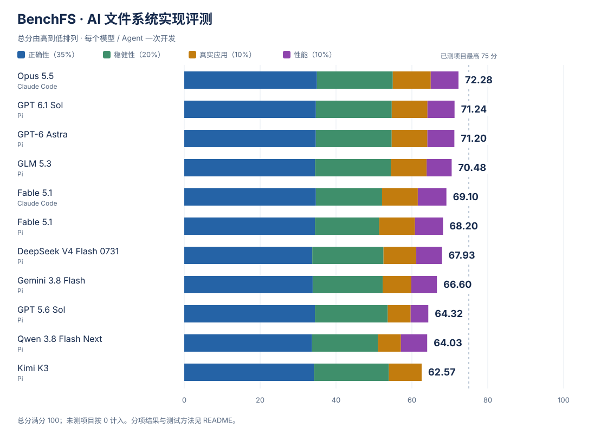

# BenchFS：AI 能独立写出一个可靠的文件系统吗？

[English](README.md) · [评测结果](#results) · [测试方法](#methods) · [实验设置](#setup)

把一个文件存进电脑，看起来只是一次点击。文件系统却要在背后完成一连串工作：找到可用空间，写入数据，更新目录，并确保下一次打开时，文件仍然完好。多个程序同时读写、磁盘接近写满、运行突然中断，都会让这件事变得更复杂。

**BenchFS 把这项任务交给了 AI。** 我们提供统一的任务规格、Rust SDK、FUSE 接口和初始代码框架，由编程 agent 自主完成实现、测试和调试。交付的文件系统随后在全新的虚拟机中重新构建，接受独立测试。

文件系统的难点在于各个部分必须协同工作。一次局部修改可能影响另一个操作，一次看似成功的写入也可能在重新启动后才暴露问题。BenchFS 希望回答：当一项工程需要持续开发、许多细节必须同时正确时，AI 能交付怎样的成果？

<a id="results"></a>

## 评测结果

以下展示 Core 文件系统任务的成绩。测试覆盖文件操作、磁盘格式、稳健性、崩溃恢复和真实应用，按总分从高到低排列。

<!-- core-results:begin -->


分项满分均为 100。总分沿用现有权重，当前已测项目合计占 **65 分**；其余项目尚未测量，按 0 计入总分。点击模型名称可查看详细报告。

| 模型 | 编程 Agent | 总分 / 100 | 正确性 | 稳健性 | 真实应用 | 开发活跃时长 | 输出 tokens | 估算费用（美元） |
|---|---|---:|---:|---:|---:|---:|---:|---:|
| [Opus 5.5](results/core/opus-5.5-high-cc.zh-CN.md) | Claude Code | **64.97** | 99.73 | 100.00 | 100.00 | 3:07:09 | 472,273 | $39.28 |
| [GPT 6.1 Sol](results/core/gpt-6.1-sol-high.zh-CN.md) | Pi | **64.10** | 97.45 | 100.00 | 83.33 | 7:14:12 | 184,515 | $12.87 |
| [GPT-6 Astra](results/core/gpt-6-astra-high.zh-CN.md) | Pi | **64.09** | 97.33 | 100.00 | 83.33 | 3:52:51 | 199,142 | $77.86 |
| [GLM 5.3](results/core/glm-5.3-high.zh-CN.md) | Pi | **63.89** | 95.81 | 99.77 | 83.33 | 7:32:19 | 541,837 | $62.99 |
| [Kimi K3](results/core/kimi-k3-high.zh-CN.md) | Pi | **62.57** | 93.48 | 96.20 | 66.67 | 6:52:08 | 478,897 | $90.50 |
| [Fable 5.1](results/core/fable-5.1-high-cc.zh-CN.md) | Claude Code | **61.56** | 97.45 | 68.52 | 83.33 | 2:59:12 | 340,562 | $40.69 |
| [DeepSeek V4 Flash 0731](results/core/deepseek-v4-flash-0731-high.zh-CN.md) | Pi | **61.15** | 89.72 | 82.48 | 66.67 | ≥12:19:49 | 518,078 | $3.26 |
| [Fable 5.1](results/core/fable-5.1-high.zh-CN.md) | Pi | **60.81** | 95.52 | 63.43 | 83.33 | 5:16:10 | 298,429 | $72.41 |
| [Gemini 3.8 Flash](results/core/gemini-3.8-flash-high.zh-CN.md) | Pi | **59.85** | 90.57 | 78.59 | 50.00 | 3:05:17 | 267,908 | $31.62 |
| [GPT 5.6 Sol](results/core/gpt-5.6-sol-high.zh-CN.md) | Pi | **59.67** | 95.44 | 88.45 | 33.33 | 2:42:57 | 87,220 | $7.81 |
| [Qwen 3.8 Flash Next](results/core/qwen-3.8-flash-next-high.zh-CN.md) | Pi | **57.10** | 89.21 | 67.85 | 33.33 | ≥12:00:54 | 734,568 | $3.29 |

每行对应一次独立开发。Agent 配置见下文；不同 Agent 的结果分别列出。总分的计算方式见[评分方法](docs/scoring.zh-CN.md)。

开发活跃时长采用 Agent 的累计计时（时:分:秒）；“≥”表示仅有最后一次记录，未记录最终完成时间。输出 tokens 统计主模型用量，包含推理。费用按各报告注明的 API 标价和缓存用量估算，Claude Code 包含任务完成判断所用模型的开销；订阅运行同样按 API 标价折算。耗时、token 用量和费用均不参与评分，完整用量与计算依据见详细报告。

<details>
<summary>参考实现</summary>

Reference 为参考实现，成绩和报告如下。

| 实现 | 总分 / 100 | 正确性 | 稳健性 | 真实应用 |
|---|---:|---:|---:|---:|
| [Reference](results/eval-only/reference-calibration.zh-CN.md) | 61.50 | 74.87 | 97.82 | 100.00 |

</details>
<!-- core-results:end -->

<a id="methods"></a>

## 如何评测

```text
提供统一规格、SDK 和代码框架
              ↓
Agent 自主开发、测试和调试
              ↓
收取源码，在新的虚拟机中重新构建
              ↓
运行独立测试，汇总各项成绩
```

Agent 负责实现文件系统的存储和操作逻辑；固定的 FUSE adapter 将 Linux 文件操作转交给实现。开发期间，agent 可以使用提供的反馈测试。完整评测在提交之后进行，agent 不会根据评测结果继续修改实现。

下表均沿用总表顺序。“通过 / 适用”表示满足测试要求的项目数与参与统计的项目数，包含符合预期的失败；不适用项不计入分母，超时计失败。除磁盘格式外，各项得分按测试类别等权平均，因此可能与按项目计数的通过率不同。磁盘格式按专门的规则计分。[完整评分说明](docs/scoring.zh-CN.md)

### 文件操作

文件系统首先要正确处理日常操作，包括文件读写、目录管理、链接和权限检查。我们结合 BenchFS 专项测试与两套上游测试，检查单项操作及其组合是否符合要求。

**BenchFS 语义测试。** 按任务规格检查文件系统应提供的行为，覆盖基本操作及其边界情况。

<!-- profile-spec-tests:begin -->
| 模型 / Agent | 通过 / 适用 | 通过率 | 得分 / 100 |
|---|---:|---:|---:|
| [Opus 5.5](results/core/opus-5.5-high-cc.zh-CN.md) · Claude Code | 44 / 44 | 100.00% | 100.00 |
| [GPT 6.1 Sol](results/core/gpt-6.1-sol-high.zh-CN.md) · Pi | 44 / 44 | 100.00% | 100.00 |
| [GPT-6 Astra](results/core/gpt-6-astra-high.zh-CN.md) · Pi | 44 / 44 | 100.00% | 100.00 |
| [GLM 5.3](results/core/glm-5.3-high.zh-CN.md) · Pi | 44 / 44 | 100.00% | 100.00 |
| [Kimi K3](results/core/kimi-k3-high.zh-CN.md) · Pi | 44 / 44 | 100.00% | 100.00 |
| [Fable 5.1](results/core/fable-5.1-high-cc.zh-CN.md) · Claude Code | 44 / 44 | 100.00% | 100.00 |
| [DeepSeek V4 Flash 0731](results/core/deepseek-v4-flash-0731-high.zh-CN.md) · Pi | 44 / 44 | 100.00% | 100.00 |
| [Fable 5.1](results/core/fable-5.1-high.zh-CN.md) · Pi | 44 / 44 | 100.00% | 100.00 |
| [Gemini 3.8 Flash](results/core/gemini-3.8-flash-high.zh-CN.md) · Pi | 44 / 44 | 100.00% | 100.00 |
| [GPT 5.6 Sol](results/core/gpt-5.6-sol-high.zh-CN.md) · Pi | 44 / 44 | 100.00% | 100.00 |
| [Qwen 3.8 Flash Next](results/core/qwen-3.8-flash-next-high.zh-CN.md) · Pi | 44 / 44 | 100.00% | 100.00 |
<!-- profile-spec-tests:end -->

**pjdfstest。** 通过系统调用检查文件操作的 POSIX 语义，包括权限、元数据和错误处理。

<!-- profile-pjdfstest-core:begin -->
| 模型 / Agent | 通过 / 适用 | 通过率 | 得分 / 100 |
|---|---:|---:|---:|
| [Opus 5.5](results/core/opus-5.5-high-cc.zh-CN.md) · Claude Code | 169 / 169 | 100.00% | 100.00 |
| [GPT 6.1 Sol](results/core/gpt-6.1-sol-high.zh-CN.md) · Pi | 169 / 169 | 100.00% | 100.00 |
| [GPT-6 Astra](results/core/gpt-6-astra-high.zh-CN.md) · Pi | 169 / 169 | 100.00% | 100.00 |
| [GLM 5.3](results/core/glm-5.3-high.zh-CN.md) · Pi | 169 / 169 | 100.00% | 100.00 |
| [Kimi K3](results/core/kimi-k3-high.zh-CN.md) · Pi | 169 / 169 | 100.00% | 100.00 |
| [Fable 5.1](results/core/fable-5.1-high-cc.zh-CN.md) · Claude Code | 169 / 169 | 100.00% | 100.00 |
| [DeepSeek V4 Flash 0731](results/core/deepseek-v4-flash-0731-high.zh-CN.md) · Pi | 169 / 169 | 100.00% | 100.00 |
| [Fable 5.1](results/core/fable-5.1-high.zh-CN.md) · Pi | 168 / 169 | 99.41% | 99.26 |
| [Gemini 3.8 Flash](results/core/gemini-3.8-flash-high.zh-CN.md) · Pi | 169 / 169 | 100.00% | 100.00 |
| [GPT 5.6 Sol](results/core/gpt-5.6-sol-high.zh-CN.md) · Pi | 169 / 169 | 100.00% | 100.00 |
| [Qwen 3.8 Flash Next](results/core/qwen-3.8-flash-next-high.zh-CN.md) · Pi | 169 / 169 | 100.00% | 100.00 |
<!-- profile-pjdfstest-core:end -->

**xfstests。** 使用上游文件系统测试，进一步检查操作组合、数据完整性和较复杂的使用场景。

<!-- profile-xfstests-core:begin -->
| 模型 / Agent | 通过 / 适用 | 通过率 | 得分 / 100 |
|---|---:|---:|---:|
| [Opus 5.5](results/core/opus-5.5-high-cc.zh-CN.md) · Claude Code | 189 / 194 | 97.42% | 98.90 |
| [GPT 6.1 Sol](results/core/gpt-6.1-sol-high.zh-CN.md) · Pi | 187 / 194 | 96.39% | 89.81 |
| [GPT-6 Astra](results/core/gpt-6-astra-high.zh-CN.md) · Pi | 179 / 194 | 92.27% | 89.31 |
| [GLM 5.3](results/core/glm-5.3-high.zh-CN.md) · Pi | 183 / 194 | 94.33% | 89.17 |
| [Kimi K3](results/core/kimi-k3-high.zh-CN.md) · Pi | 186 / 194 | 95.88% | 89.75 |
| [Fable 5.1](results/core/fable-5.1-high-cc.zh-CN.md) · Claude Code | 188 / 194 | 96.91% | 94.36 |
| [DeepSeek V4 Flash 0731](results/core/deepseek-v4-flash-0731-high.zh-CN.md) · Pi | 167 / 194 | 86.08% | 84.02 |
| [Fable 5.1](results/core/fable-5.1-high.zh-CN.md) · Pi | 183 / 194 | 94.33% | 87.35 |
| [Gemini 3.8 Flash](results/core/gemini-3.8-flash-high.zh-CN.md) · Pi | 175 / 194 | 90.21% | 84.61 |
| [GPT 5.6 Sol](results/core/gpt-5.6-sol-high.zh-CN.md) · Pi | 184 / 194 | 94.85% | 89.62 |
| [Qwen 3.8 Flash Next](results/core/qwen-3.8-flash-next-high.zh-CN.md) · Pi | 168 / 194 | 86.60% | 81.52 |
<!-- profile-xfstests-core:end -->

### 磁盘格式

文件能够正常读取，并不意味着磁盘上的数据组织一定正确。这组测试直接检查文件系统写出的磁盘内容，验证其是否符合规定的存储格式。表中同时列出检查通过率和格式一致性得分。

<!-- profile-canonical-format:begin -->
| 模型 / Agent | 通过 / 适用 | 通过率 | 得分 / 100 |
|---|---:|---:|---:|
| [Opus 5.5](results/core/opus-5.5-high-cc.zh-CN.md) · Claude Code | 479 / 479 | 100.00% | 100.00 |
| [GPT 6.1 Sol](results/core/gpt-6.1-sol-high.zh-CN.md) · Pi | 479 / 479 | 100.00% | 100.00 |
| [GPT-6 Astra](results/core/gpt-6-astra-high.zh-CN.md) · Pi | 479 / 479 | 100.00% | 100.00 |
| [GLM 5.3](results/core/glm-5.3-high.zh-CN.md) · Pi | 417 / 479 | 87.06% | 94.05 |
| [Kimi K3](results/core/kimi-k3-high.zh-CN.md) · Pi | 410 / 479 | 85.59% | 84.17 |
| [Fable 5.1](results/core/fable-5.1-high-cc.zh-CN.md) · Claude Code | 431 / 479 | 89.98% | 95.45 |
| [DeepSeek V4 Flash 0731](results/core/deepseek-v4-flash-0731-high.zh-CN.md) · Pi | 388 / 479 | 81.00% | 74.86 |
| [Fable 5.1](results/core/fable-5.1-high.zh-CN.md) · Pi | 431 / 479 | 89.98% | 95.45 |
| [Gemini 3.8 Flash](results/core/gemini-3.8-flash-high.zh-CN.md) · Pi | 419 / 479 | 87.47% | 77.66 |
| [GPT 5.6 Sol](results/core/gpt-5.6-sol-high.zh-CN.md) · Pi | 442 / 479 | 92.28% | 92.15 |
| [Qwen 3.8 Flash Next](results/core/qwen-3.8-flash-next-high.zh-CN.md) · Pi | 368 / 479 | 76.83% | 75.33 |
<!-- profile-canonical-format:end -->

### 稳健性

文件系统还需要应对资源紧张和操作失败。这组测试考察它在压力与异常条件下的表现，检查这些情况是否影响已有数据和后续操作。

<!-- profile-robustness:begin -->
| 模型 / Agent | 通过 / 适用 | 通过率 | 得分 / 100 |
|---|---:|---:|---:|
| [Opus 5.5](results/core/opus-5.5-high-cc.zh-CN.md) · Claude Code | 47 / 47 | 100.00% | 100.00 |
| [GPT 6.1 Sol](results/core/gpt-6.1-sol-high.zh-CN.md) · Pi | 47 / 47 | 100.00% | 100.00 |
| [GPT-6 Astra](results/core/gpt-6-astra-high.zh-CN.md) · Pi | 47 / 47 | 100.00% | 100.00 |
| [GLM 5.3](results/core/glm-5.3-high.zh-CN.md) · Pi | 47 / 47 | 100.00% | 100.00 |
| [Kimi K3](results/core/kimi-k3-high.zh-CN.md) · Pi | 46 / 47 | 97.87% | 97.50 |
| [Fable 5.1](results/core/fable-5.1-high-cc.zh-CN.md) · Claude Code | 47 / 47 | 100.00% | 100.00 |
| [DeepSeek V4 Flash 0731](results/core/deepseek-v4-flash-0731-high.zh-CN.md) · Pi | 35 / 47 | 74.47% | 69.58 |
| [Fable 5.1](results/core/fable-5.1-high.zh-CN.md) · Pi | 44 / 47 | 93.62% | 90.28 |
| [Gemini 3.8 Flash](results/core/gemini-3.8-flash-high.zh-CN.md) · Pi | 43 / 47 | 91.49% | 89.58 |
| [GPT 5.6 Sol](results/core/gpt-5.6-sol-high.zh-CN.md) · Pi | 40 / 47 | 85.11% | 78.75 |
| [Qwen 3.8 Flash Next](results/core/qwen-3.8-flash-next-high.zh-CN.md) · Pi | 32 / 47 | 68.09% | 66.25 |
<!-- profile-robustness:end -->

### 崩溃恢复

运行意外中断后，文件系统需要处理磁盘上留下的状态。我们中断正在运行的操作，再尝试重新启动文件系统，检查它是否按照任务要求处理恢复、保留应当持久化的数据，并维持结构完整。

<!-- profile-crash-core:begin -->
| 模型 / Agent | 通过 / 适用 | 通过率 | 得分 / 100 |
|---|---:|---:|---:|
| [Opus 5.5](results/core/opus-5.5-high-cc.zh-CN.md) · Claude Code | 216 / 216 | 100.00% | 100.00 |
| [GPT 6.1 Sol](results/core/gpt-6.1-sol-high.zh-CN.md) · Pi | 216 / 216 | 100.00% | 100.00 |
| [GPT-6 Astra](results/core/gpt-6-astra-high.zh-CN.md) · Pi | 216 / 216 | 100.00% | 100.00 |
| [GLM 5.3](results/core/glm-5.3-high.zh-CN.md) · Pi | 215 / 216 | 99.54% | 99.54 |
| [Kimi K3](results/core/kimi-k3-high.zh-CN.md) · Pi | 205 / 216 | 94.91% | 94.91 |
| [Fable 5.1](results/core/fable-5.1-high-cc.zh-CN.md) · Claude Code | 80 / 216 | 37.04% | 37.04 |
| [DeepSeek V4 Flash 0731](results/core/deepseek-v4-flash-0731-high.zh-CN.md) · Pi | 206 / 216 | 95.37% | 95.37 |
| [Fable 5.1](results/core/fable-5.1-high.zh-CN.md) · Pi | 79 / 216 | 36.57% | 36.57 |
| [Gemini 3.8 Flash](results/core/gemini-3.8-flash-high.zh-CN.md) · Pi | 146 / 216 | 67.59% | 67.59 |
| [GPT 5.6 Sol](results/core/gpt-5.6-sol-high.zh-CN.md) · Pi | 212 / 216 | 98.15% | 98.15 |
| [Qwen 3.8 Flash Next](results/core/qwen-3.8-flash-next-high.zh-CN.md) · Pi | 150 / 216 | 69.44% | 69.44 |
<!-- profile-crash-core:end -->

### 真实应用

最后，我们将文件系统交给真实应用使用，检查应用能否完成任务、产出正确的数据，并在重新打开后继续正常工作。

<!-- profile-real-world:begin -->
| 模型 / Agent | 通过 / 适用 | 通过率 | 得分 / 100 |
|---|---:|---:|---:|
| [Opus 5.5](results/core/opus-5.5-high-cc.zh-CN.md) · Claude Code | 4 / 4 | 100.00% | 100.00 |
| [GPT 6.1 Sol](results/core/gpt-6.1-sol-high.zh-CN.md) · Pi | 3 / 4 | 75.00% | 83.33 |
| [GPT-6 Astra](results/core/gpt-6-astra-high.zh-CN.md) · Pi | 3 / 4 | 75.00% | 83.33 |
| [GLM 5.3](results/core/glm-5.3-high.zh-CN.md) · Pi | 3 / 4 | 75.00% | 83.33 |
| [Kimi K3](results/core/kimi-k3-high.zh-CN.md) · Pi | 3 / 4 | 75.00% | 66.67 |
| [Fable 5.1](results/core/fable-5.1-high-cc.zh-CN.md) · Claude Code | 3 / 4 | 75.00% | 83.33 |
| [DeepSeek V4 Flash 0731](results/core/deepseek-v4-flash-0731-high.zh-CN.md) · Pi | 2 / 4 | 50.00% | 66.67 |
| [Fable 5.1](results/core/fable-5.1-high.zh-CN.md) · Pi | 3 / 4 | 75.00% | 83.33 |
| [Gemini 3.8 Flash](results/core/gemini-3.8-flash-high.zh-CN.md) · Pi | 2 / 4 | 50.00% | 50.00 |
| [GPT 5.6 Sol](results/core/gpt-5.6-sol-high.zh-CN.md) · Pi | 2 / 4 | 50.00% | 33.33 |
| [Qwen 3.8 Flash Next](results/core/qwen-3.8-flash-next-high.zh-CN.md) · Pi | 2 / 4 | 50.00% | 33.33 |
<!-- profile-real-world:end -->

<a id="setup"></a>

## 实验设置

各模型使用相同的 Core 任务材料。开发与评测分别在独立的 Linux 虚拟机中进行。

| 项目 | 设置 |
|---|---|
| 开发环境 | Ubuntu Server 24.04.4 LTS，x86-64；Linux 6.8 |
| 开发 VM 资源 | 8 vCPU、16 GiB 内存，禁用 swap 和内存气球 |
| 开发数据设备 | test、scratch 各一个独立的 64 GiB 设备 |
| 工具链 | Rust 1.97.1、libfuse 3.18.2 |
| 编程 Agent | Pi 0.84.3；标注 Claude Code 的提交使用 2.1.283 |
| 推理设置 | High effort；每个模型 / Agent 组合开发一次 |
| 开发预算 | 最长 12 小时；具体记录时长见成绩表 |
| 开发工具 | 文件读写、终端和本地开发工具；不使用 subagent、MCP 或内建 Web 工具 |
| 人工参与 | 提供初始任务并管理运行环境，不提供代码修改或技术指导 |
| 测试环境 | 新 VM 重新构建源码，执行测试前锁定网络；具体资源和执行后端见模型报告 |

Pi 与 Claude Code 的工具配置和任务结束判断有所不同，成绩中分别标注。详细设置见[实验环境](docs/environment.zh-CN.md)和各模型报告。

## 详细报告与资料

成绩表中的模型名称直接链接完整报告，包含测试统计、开发过程的用量和源码规模。源码规模仅作描述，不作为实现质量评分。

- [评分方法](docs/scoring.zh-CN.md)：分项成绩与总分的计算方式。
- [实验环境](docs/environment.zh-CN.md)：开发与测试配置。
- [任务与功能](docs/benchmark.zh-CN.md)：任务范围和提供给 agent 的材料。
- [测试套件](docs/test-suite.zh-CN.md)：测试组成和开发反馈。
- [SDK、FUSE adapter 与代码框架](crates/)：参与者使用的固定接口。

为减少测试内容进入后续模型训练的可能，本仓库公开汇总成绩、方法和接口代码，保留任务规格正文、具体测试用例及候选实现。
